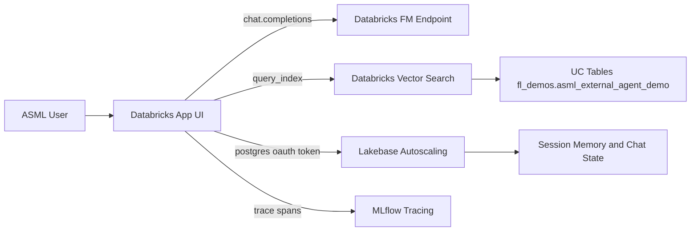

# ASML Demo Day Package

## 1) One-Slide Architecture

Use this as your single architecture slide content.

### Title
Databricks FM Agent + Lakebase + Vector Search

### Diagram

### Key message bullets
- Agent runtime is Databricks FM endpoint (no ngrok dependency).
- Databricks provides governed retrieval (Vector Search) and operational state (Lakebase).
- Databricks App gives enterprise-ready UI, tracing, and evaluation hooks.

## 2) 3-Minute Executive Talk Track

### 0:00 - 0:30 (Context)
"This demo shows an FM-endpoint-first pattern on Databricks. We combine Vector Search for grounded retrieval, Lakebase for transactional memory, and MLflow tracing/evaluation for repeatable quality."

### 0:30 - 1:30 (Live flow)
"From this Databricks App, we send a question directly to a Databricks FM endpoint with retrieved context from Vector Search. Session memory is persisted in Lakebase. The response path is grounded, auditable, and production-friendly."

### 1:30 - 2:20 (Proof points)
"Here we show retrieved evidence, latency metrics, persisted session memory, and MLflow trace verification. This demonstrates a reusable customer framework with measurable quality."

### 2:20 - 3:00 (Business outcome)
"ASML gets a repeatable pattern for customer deployments: FM generation, governed retrieval, transactional memory, and standardized evaluation."

## 3) FM Endpoint Fallback Plan (If dependencies degrade)

### Symptoms
- App dependency status is `DEGRADED`.
- FM endpoint or data dependency checks fail.

### Recovery (2-3 minutes)
1. Verify app env config:
   - `FM_ENDPOINT_NAME`
   - `VS_INDEX_NAME`
   - `LAKEBASE_ENDPOINT_RESOURCE`
2. Verify endpoint/index health with Databricks CLI or MCP tools.
3. Redeploy Databricks app:
   - `databricks workspace import-dir "./apps/asml_showcase_app" "/Workspace/Users/fabian.lanz@databricks.com/asml_showcase_app" --overwrite -p azure-demo`
   - `databricks apps deploy asml-external-agent-showcase --source-code-path "/Workspace/Users/fabian.lanz@databricks.com/asml_showcase_app" -p azure-demo`

## 4) Go-Live-in-5-Minutes Checklist

Run this before the customer joins:

- [ ] `FM_ENDPOINT_NAME` resolves and is accessible.
- [ ] `VS_INDEX_NAME` and `LAKEBASE_ENDPOINT_RESOURCE` are configured in app env.
- [ ] Databricks app deployment is `SUCCEEDED` and app is `RUNNING`.
- [ ] Open app URL in browser and verify sidebar backend status is `UP`.
- [ ] Run one warm-up chat request to prime caches.
- [ ] Keep terminal tabs open for quick log checks:
  - `databricks apps logs asml-external-agent-showcase --tail-lines 100 -p azure-demo`

## 5) Optional Q&A Answers

- **Why FM endpoint first?**  
  Removes tunnel dependencies and uses native Databricks serving/auth path.

- **How is governance handled?**  
  Data remains in Unity Catalog + Databricks services, with managed access paths.

- **Can this scale?**  
  Yes. Vector Search and Lakebase scale independently, and agent runtime can be horizontally scaled.
