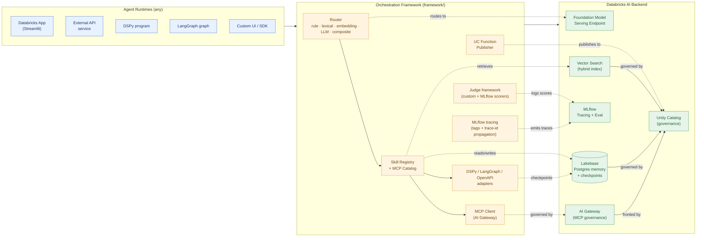
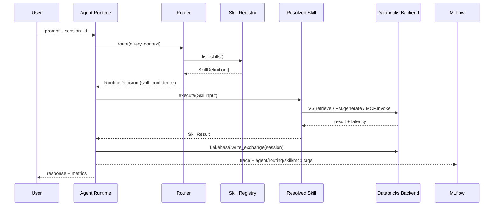

# AI Orchestration Framework

Databricks-first reference architecture for running **any AI agent runtime**
(DSPy, LangGraph, external services, custom) on top of a governed Databricks
AI backend — Foundation Model Serving, Vector Search, Lakebase memory,
MLflow tracing, and AI Gateway-governed MCP.

## Architecture



### Routed turn — sequence



## Core backend services

- **FM Endpoint** — centralized LLM inference via Databricks Model Serving.
- **Vector Search** — semantic + hybrid retrieval over curated knowledge.
- **Lakebase** — transactional session memory and operational state.
- **MLflow** — end-to-end tracing, quality evaluation, observability.
- **Unity Catalog** — governance over data, tools (UC Functions), and
  AI Gateway connections.
- **AI Gateway** — Unity-Catalog-governed control plane for MCP servers:
  unified auth, permissions, and audit for managed / external / custom
  MCP tools.

## Orchestration surfaces

- **Skill Registry** — Protocol-based registry for declaring, discovering,
  and executing agent skills.
- **Router** — Intent-to-skill dispatch: rule-based, lexical, embedding,
  LLM, and composite cascading strategies.
- **MCP Catalog + Client** — Register managed / external / custom MCP
  servers and invoke their tools through a single governed path
  (Streamable HTTP via the official `mcp` SDK, AI Gateway-fronted).
- **UC Function Publisher** — Publish framework skills as Unity Catalog
  Functions, automatically discoverable as MCP tools via the managed
  Functions MCP endpoint.
- **Unified Tool Catalog** — Single JSON payload combining native skills,
  UC Functions, and MCP tools for external agents.
- **Judge Framework** — Custom judges + MLflow scorer bridge.
- **DSPy / LangGraph Adapters** — Optional bridges so these frameworks
  can use the Databricks backend directly.
- **Observability Tags** — Stable MLflow trace tag schema (`agent.*`,
  `routing.*`, `skill.*`, `mcp.*`) consumed by any dashboard.

## Repository Structure

- `apps/ai_infra_showcase_app/` — Streamlit Databricks App reference
- `framework/` — reusable modules:
  - `router/` — package: protocol, tiers (rule, lexical, embedding, LLM),
    composite, orchestrator, routing judge
  - `skill_registry.py` — skill protocol, registry with keyword or
    embedding discovery
  - `reference_skills.py` — Vector Search / Memory / Generate reference skills
  - `fm_agent_utils.py` — FM Serving client with retry/backoff + health
  - `vector_search_utils.py` — typed retrieval + context formatting
  - `lakebase_utils.py` — session memory with OAuth-first auth
  - `mlflow_tracing_utils.py` — tracing + stable tag schema
    (`AgentContext`, `set_*_tags`, header serdes, context manager)
  - `external_model_hooks.py` — `ExternalModelClient` + OpenAPI client
  - `mcp_catalog_utils.py` — MCP server catalog + tool discovery
  - `mcp_client.py` — AI Gateway-governed MCP invocation client
  - `mcp_auth.py` — U2M / M2M / PAT auth strategies + compat check
  - `mcp_servers.py` — factory helpers for managed / external / custom servers
  - `mcp_tool_skill.py` — internal MCP tool ↔ skill adapter
  - `uc_function_publisher.py` — publish skills as UC Functions
  - `reference_uc_bindings.py` — worked bindings for Vector Search + Generate
  - `unified_catalog.py` — single payload for external agents
  - `judge_hooks.py` — custom judge protocol + MLflow scorer bridge
  - `dspy_adapter.py` / `langgraph_adapter.py` — optional adapters
- `scripts/` — bootstrap, synthetic data, evaluation:
  - `bootstrap_ai_infra_resources.py` — UC / VS / Lakebase provisioning
  - `bootstrap_skill_catalog.py` — populate skill registry + MCP catalog
  - `build_eval_dataset.py` / `run_mlflow_eval.py` — MLflow GenAI evaluation
  - `build_assessment_dataset.py` / `run_assessment.py` — custom-judge assessment
  - `run_routing_eval.py` — routing accuracy regression suite
- `tests/unit/` — unit tests for every module
- `tests/integration/` — end-to-end round-trip tests
- `docs/` — reference docs:
  - [`observability_tags.md`](./docs/observability_tags.md) — trace tag schema
  - [`mcp_integration.md`](./docs/mcp_integration.md) — MCP client + auth + discovery
  - [`uc_function_publishing.md`](./docs/uc_function_publishing.md) — publish skills as UC Functions
  - [`routing_architecture.md`](./docs/routing_architecture.md) — router design
  - [`external_connectivity_guidelines.md`](./docs/external_connectivity_guidelines.md) — production connectivity
  - [`mlflow_judging_guidelines.md`](./docs/mlflow_judging_guidelines.md) — judge patterns
  - `guides/` — module-level how-tos:
    [external models](./docs/guides/external-models.md),
    [vector search](./docs/guides/vector-search.md),
    [Lakebase memory](./docs/guides/lakebase-memory.md),
    [MLflow tracing](./docs/guides/mlflow-tracing.md)

## Installation

The framework is packaged via `pyproject.toml` with optional extras so
you install only what you use:

```bash
pip install -e ".[mcp]"        # core + MCP client
pip install -e ".[dspy]"       # core + DSPy adapter
pip install -e ".[langgraph]"  # core + LangGraph adapter
pip install -e ".[app]"        # core + Streamlit demo app
pip install -e ".[dev]"        # core + pytest + ruff
pip install -e ".[all]"        # everything
```

## Quickstart — in-workspace agent

```python
from databricks.sdk import WorkspaceClient
from framework.mcp_auth import WorkspaceClientAuth
from framework.mcp_client import DatabricksMCPClient
from framework.mcp_catalog_utils import MCPCatalogClient
from framework.mcp_servers import managed_functions_server
from framework.skill_registry import SkillRegistry

wc = WorkspaceClient()
auth = WorkspaceClientAuth(wc)                     # auto-detects U2M / M2M
client = DatabricksMCPClient(auth=auth)

catalog = MCPCatalogClient()
catalog.set_client(client)
catalog.register_server(
    managed_functions_server("{catalog}", "{schema}", wc.config.host),
)
catalog.discover_tools()                           # populates via list_tools RPC

registry = SkillRegistry()
catalog.sync_to_skill_registry(registry)
# Every MCP tool is now callable as a framework skill.
```

## Quickstart — external (Pattern A) agent

For an agent running outside Databricks with service principal credentials
(`DATABRICKS_CLIENT_ID`, `DATABRICKS_CLIENT_SECRET`, `DATABRICKS_HOST` in env):

```python
from framework.mcp_auth import auto_select_auth
from framework.mcp_client import DatabricksMCPClient

auth = auto_select_auth()                          # picks SP M2M from env
client = DatabricksMCPClient(auth=auth)
# ... same catalog / discover / invoke flow as above
```

## Publish a skill as a UC Function

Any skill deployed behind a Model Serving endpoint can be published as a
Unity Catalog Function — and will automatically be discoverable as an MCP
tool via the managed Functions MCP endpoint.

```python
from databricks.sdk import WorkspaceClient
from framework.reference_uc_bindings import vector_search_binding
from framework.uc_function_publisher import publish_skill

binding = vector_search_binding(
    catalog="{catalog}",
    schema="{schema}",
    serving_endpoint="https://{workspace-host}/serving-endpoints/{endpoint-name}/invocations",
)
fq = publish_skill(binding, WorkspaceClient(), sql_warehouse_id="{warehouse-id}")
# => "{catalog}.{schema}.vector_search"
```

See [`docs/uc_function_publishing.md`](./docs/uc_function_publishing.md)
for the full service-mode deployment model.

## Evaluation

Baseline MLflow GenAI evaluation:

```bash
python scripts/build_eval_dataset.py
python scripts/run_mlflow_eval.py
```

Custom-judge assessment (format compliance, latency threshold,
groundedness) alongside MLflow scorers:

```bash
python scripts/build_assessment_dataset.py
python scripts/run_assessment.py
```

Routing accuracy regression against expected skill mappings:

```bash
python scripts/run_routing_eval.py
```

Custom judges implement the `JudgeClient` protocol in
`framework/judge_hooks.py`. Add domain-specific judges by implementing
`name` and `evaluate(JudgeInput) -> JudgeVerdict`. See
[`docs/mlflow_judging_guidelines.md`](./docs/mlflow_judging_guidelines.md)
for patterns.

## Observability

Every framework primitive emits a stable set of MLflow trace tags so
dashboards and monitoring tools can attribute cost, latency, and quality:

- `agent.*` — caller identity
- `routing.*` — router decisions
- `skill.*` — skill execution
- `mcp.*` — MCP tool invocations

Full contract in
[`docs/observability_tags.md`](./docs/observability_tags.md).

## Databricks Runtime Guidance

- Build and test for **Databricks Serverless** and the latest supported
  DBR.
- Use Databricks SDK APIs and SQL interfaces to keep logic portable.
- Treat retrieval, memory, MCP, and tracing as backend capabilities that
  are independent of the agent framework choice.

## Goal

A repeatable pattern where teams innovate on agent UX and orchestration
while relying on Databricks for scalable, governed AI infrastructure —
with every tool invocation, regardless of surface (skill / UC Function /
MCP), governed by Unity Catalog and observable through MLflow.
