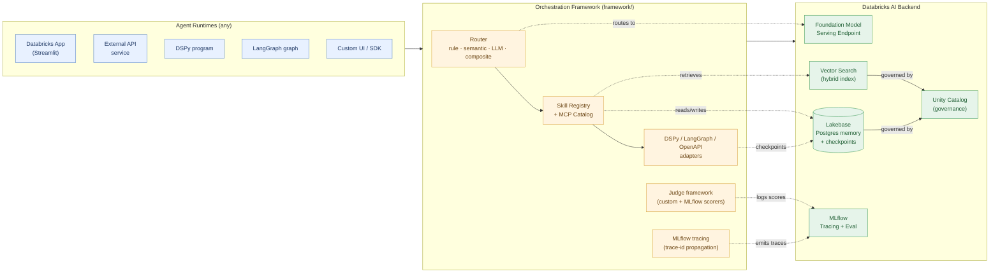
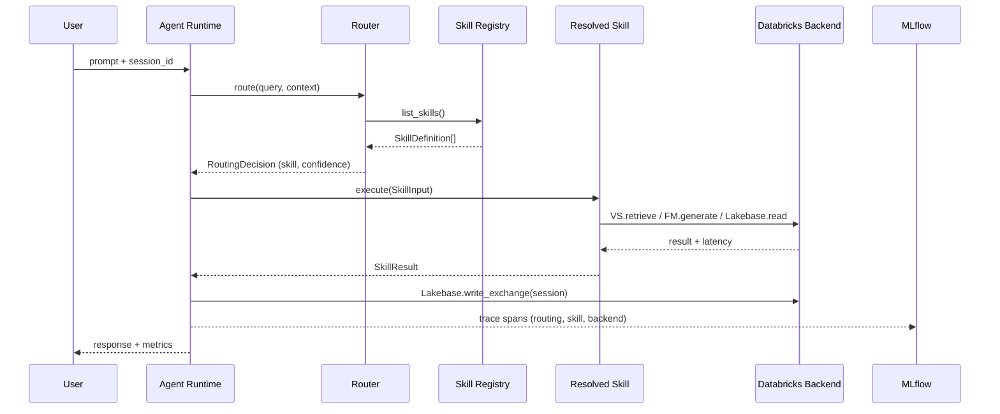

# AI Infra Orchestration

Databricks-first reference architecture for running **any AI agent frontend/runtime** on top of a governed Databricks AI backend.

This repository demonstrates how to connect external or custom agent runtimes to Databricks infrastructure components for retrieval, memory, model inference, tracing, and evaluation.

## Architecture



### Routed turn — sequence



### Core backend services

- **FM Endpoint**: centralized LLM inference through Databricks Model Serving.
- **Vector Search**: semantic + hybrid retrieval over curated enterprise knowledge.
- **Lakebase**: transactional session memory and operational state.
- **MLflow**: end-to-end tracing, quality evaluation, and observability.
- **Unity Catalog**: governance and access control over all data assets.

### Routing & skill orchestration

- **Skill Registry**: Protocol-based registry for declaring, discovering, and executing agent skills.
- **MCP Catalog**: Unified catalog for managed, custom, and external MCP servers.
- **Router**: Intent-to-skill dispatch with rule-based, semantic, LLM, and composite strategies.
- **DSPy / LangGraph Adapters**: Optional adapter layers so these frameworks can use Databricks infra.

## Connect Any Agent Through Databricks Backend

The design supports multiple agent implementations while keeping the backend standardized.

### 1. Agent request flow

1. Receive user prompt in any agent runtime.
2. Retrieve context from Databricks Vector Search.
3. Build grounded prompt with retrieved evidence.
4. Generate response from Databricks FM endpoint.
5. Persist state/events in Lakebase.
6. Emit traces/metrics with MLflow.

### 2. Required integration contracts

- **Retrieval contract**: `query -> top_k rows + latency`.
- **Generation contract**: `system_prompt + user_prompt -> model response + latency`.
- **Memory contract**: `session_id + role + content + metadata`.
- **Tracing contract**: trace/span IDs propagated across service boundaries.

### 3. Backend configuration (minimum)

- `FM_ENDPOINT_NAME`
- `VS_INDEX_NAME`
- `LAKEBASE_ENDPOINT_RESOURCE`
- `LAKEBASE_HOST`
- `LAKEBASE_DB_NAME`
- `MLFLOW_EXPERIMENT_NAME`

## Repository Structure

- `apps/ai_infra_showcase_app/` - Streamlit Databricks App reference implementation
- `framework/` - reusable integration utilities:
  - `fm_agent_utils.py` - FM serving client with retry/backoff, cheap liveness probe, and `deep_health()` for end-to-end checks
  - `vector_search_utils.py` - typed `RetrievalRow` dataclass, hybrid retrieval, context-block formatter
  - `lakebase_utils.py` - session memory store with public `connection()` context manager and OAuth-token caching
  - `mlflow_tracing_utils.py` - `configure_tracing`, `@traced` decorator, trace-header propagation
  - `external_model_hooks.py` - `ExternalModelClient` protocol and httpx-based `OpenApiModelClient` with retry
  - `openapi_model_adapter.py` - deprecated compat shim (will be removed)
  - `judge_hooks.py` - custom judge protocol, reference judges, and MLflow scorer bridge
  - `skill_registry.py` - skill protocol, registry with keyword **or** embedding-backed discovery
  - `reference_skills.py` - VectorSearch / MemoryRead / MemoryWrite / Generate reference skills
  - `mcp_catalog_utils.py` - MCP server catalog (managed/custom/external) with skill registry bridging
  - `router.py` - router protocol with rule-based, lexical, **embedding-backed semantic**, LLM, and composite implementations
  - `dspy_adapter.py` - adapter layer for DSPy (optional dependency)
  - `langgraph_adapter.py` - adapter layer for LangGraph/LangChain (optional dependency)
  - `_text_utils.py` - shared stop-word list and term extraction
- `scripts/` - bootstrap, synthetic data generation, and evaluation scripts
  - `bootstrap_ai_infra_resources.py` - idempotent UC/VS/Lakebase provisioning (use `--force-tables` to recreate demo data)
  - `bootstrap_skill_catalog.py` - populate the skill registry + MCP catalog; exits non-zero on partial bootstrap
  - `build_eval_dataset.py` / `run_mlflow_eval.py` - baseline MLflow GenAI evaluation
  - `build_assessment_dataset.py` / `run_assessment.py` - richer assessment with custom judges
  - `run_routing_eval.py` - routing accuracy regression suite
- `tests/unit/` - pytest suite for pure-logic modules (registry, router, judges, MCP catalog, VS row typing)
- `docs/external_connectivity_guidelines.md` - production connectivity guidance
- `docs/routing_architecture.md` - routing, skill registry, and MCP catalog architecture
- `README_DEMO.md` - demo runbook with deployment steps

## Quick Start

### Local app run

```bash
cd apps/ai_infra_showcase_app
uv pip install -r requirements.txt
uv run streamlit run app.py
```

### Resource bootstrap

```bash
uv run python scripts/bootstrap_ai_infra_resources.py
```

### Evaluation

```bash
python scripts/build_eval_dataset.py
python scripts/run_mlflow_eval.py
```

### Assessment with Custom Judges

Run a full assessment using pluggable custom judges (format compliance, latency threshold, groundedness) alongside MLflow's built-in scorers:

```bash
python scripts/build_assessment_dataset.py
python scripts/run_assessment.py
```

Custom judges implement the `JudgeClient` protocol defined in `framework/judge_hooks.py`. Teams can add domain-specific judges by implementing `name` and `evaluate(JudgeInput) -> JudgeVerdict`. See `docs/mlflow_judging_guidelines.md` for the full pattern.

### Skill Catalog & Routing

Bootstrap the skill catalog with reference skills and MCP server configs:

```bash
python scripts/bootstrap_skill_catalog.py
```

Evaluate routing accuracy against expected skill mappings:

```bash
python scripts/run_routing_eval.py
```

See `docs/routing_architecture.md` for the full routing design, skill lifecycle, and DSPy/LangGraph integration patterns.

## Databricks Runtime Guidance

- Build and test for **Databricks Serverless** and latest supported DBR.
- Keep logic portable by using Databricks SDK APIs and SQL interfaces.
- Treat retrieval, memory, and tracing as backend capabilities independent from agent framework choice.

## Goal

Provide a repeatable pattern where teams can innovate on agent UX/orchestration while relying on Databricks for scalable, governed AI infrastructure.
